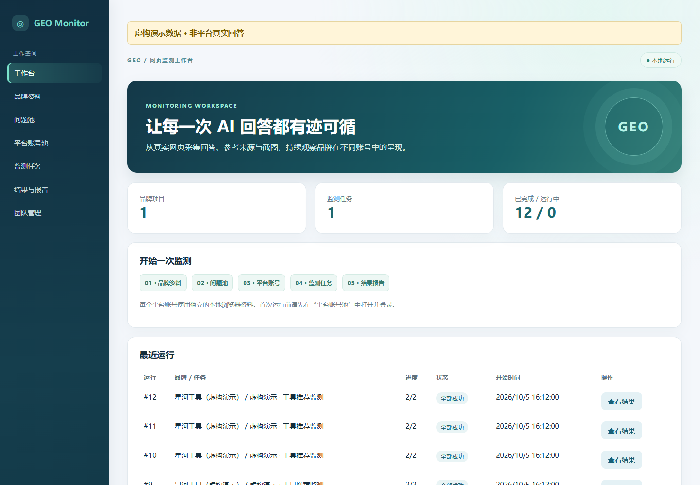
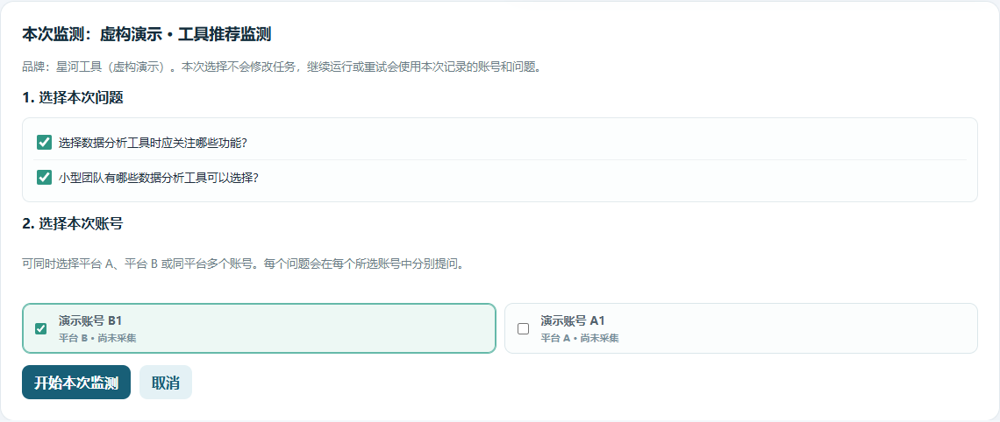
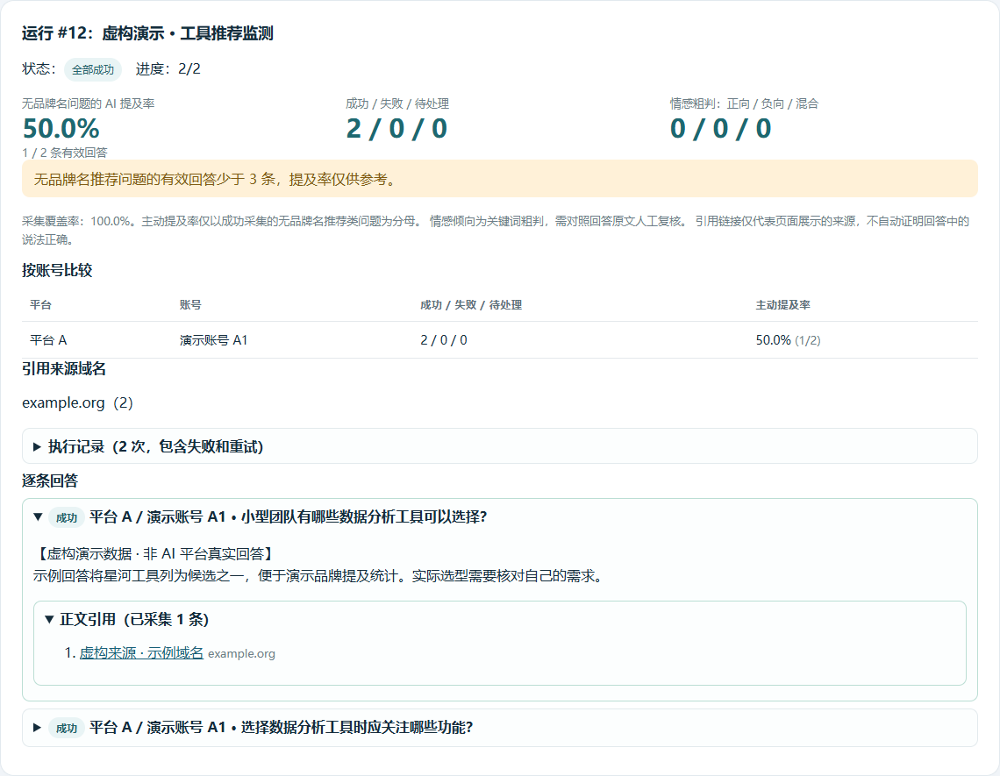

# GEO Web Monitor

**在自己的电脑上，观察品牌如何出现在 AI 网页回答中。**

A local GEO monitoring starter built with Node.js, SQLite and Playwright. Capture web answers, visible sources and screenshots using your own accounts on two mainstream Chinese AI web interfaces. [English introduction](docs/README.en.md).



这是一个面向学习和二次开发的开源基础款。它通过浏览器操作网页，不使用模型 API 代替网页问答。运行基线为 **Windows + Microsoft Edge + Node.js 24**，默认只供本机访问。

> v0.1：本地工作流已实现，两个主流中文 AI 网页版均有真实单题采集记录；不承诺所有账号、网络和页面版本稳定可用。先用自己的账号进行单题验收，再扩大批次。所有宣传截图使用虚构演示数据，不是平台效果证明。

## 第一版功能

| 区域 | 功能 |
| --- | --- |
| 品牌资料 | 名称、别名、类别、介绍、优势、官网；竞品选填 |
| 问题池 | 手动输入、每行一题批量添加、模板生成后人工审核 |
| 账号池 | 支持两个主流中文 AI 网页版的多账号管理；独立浏览器资料、名称及备注编辑 |
| 监测 | 每次选择问题和账号；每日 / 每周计划；账号内串行、最多两个账号并行 |
| 结果 | 回答、来源、截图、失败原因与执行历史；运行记录每页 10 条 |
| 报告 | 品牌提及率、账号比较、来源域名、情感关键词粗判与采集覆盖率 |
| 团队 | 首次创建管理员，可添加成员；成员共用本机项目数据 |

手动任务保存问题组，每次运行再选择账号；定期任务预设自动执行账号。



## 快速启动

安装 Node.js 24+ 与 Microsoft Edge，下载仓库并解压，在项目目录打开终端：

```powershell
npm install
npm run doctor
npm start
```

使用 pnpm 时执行 `pnpm install --frozen-lockfile`、`pnpm doctor`、`pnpm start`。

打开 <http://127.0.0.1:8790>，创建自己的管理员账号。添加品牌 → 保存一个问题 → 在账号池打开专用窗口并手动登录 → 创建手动任务 → 选择问题与账号运行 → 在结果页核对原文、来源和截图。

不需要作者的账号、手机号或 API 密钥。[完整部署教程](docs/quickstart.md)包含修改端口、启动关闭、定时任务和备份步骤。

## 运行方式与限制

- 默认使用可见 Edge，监测窗口在后台打开；主动点击“打开登录窗口”才切到前台。登录和验证会暂停任务，处理后点击继续，没有人工处理倒计时。每个账号有独立持久资料，但平台仍可让登录失效或要求验证。
- 验证由使用者手动完成；继续运行优先补采原对话。重启后尝试打开原对话地址并核对原问题，无法确认时停止。
- 账号心跳请求失败仅作为诊断信息，不会单独导致问答提前终止。回答等待上限为 120 秒。
- 搜索、深度思考和模型设置没有自动设置及核验。使用前在专用窗口确认，不同设置的样本不能直接比较。
- 定期任务需要电脑开机、服务运行；本版没有开机自启或任务守护。
- 团队成员没有项目隔离。本机版不能仅修改监听地址就作为公网生产服务。
- 网页改版、网络区域限制、验证码和长回答停顿仍可能造成失败或截取不完整。

**采集成功不等于回答事实正确。** 同题多次监测才能观察稳定性。

## 指标口径

主动提及率只统计无品牌名推荐题的成功回答。失败项与含品牌名的题目不进入分母。情感目前为关键词粗判，可能混入竞品评价，必须结合原文复核。

来源只证明网页展示了链接，不证明支持每一句话。正文引用与搜索结果分别保存，后者不会全部算作正文引用。



公开说明与演示图使用“平台 A / 平台 B”通用标签。实际支持范围、目标网址及平台差异处理见 [网页适配器配置](src/browser.js)；界面中的实际名称用于选择和登录。

## 结构与扩展

```text
public/             页面与样式
src/server.js       HTTP、登录、任务、调度与结果接口
src/browser.js      两个平台的网页采集与独立账号会话
src/core.js         任务拆分、并行与账号失败隔离
src/analysis.js     指标计算
src/db.js           SQLite 表与迁移
src/schedule.js     定期执行时间
src/backup.js       数据库与截图备份
scripts/            环境检查、启动、虚构素材与公开包导出
test/               单元、接口与浏览器回归测试
examples/           虚构品牌和问题
docs/               部署、原理、隐私与演示说明
```

[实现原理](docs/how-it-works.md) · [架构与扩展](docs/architecture.md) · [排错](docs/troubleshooting.md) · [路线图](docs/roadmap.md)

[版本记录](CHANGELOG.md) · [安全说明](SECURITY.md) · [发布方法](docs/releasing.md)

## 使用声明

本项目独立开发，与接入的 AI 平台及其运营方无官方关联，也不代表获得其认可或授权。请仅使用自己拥有或获授权的账号和数据，并遵守目标平台的使用规则；遇到登录或验证时由使用者手动处理。

软件按 [MIT 许可](LICENSE)提供。开源许可适用于本项目代码，不等于第三方平台或内容的使用授权；也不保证平台持续可访问、回答准确或品牌排名提升。

## 数据与隐私

数据库 `data/`、浏览器资料 `profiles/`、结果 `results/`、备份 `backups/` 与日志留在本机，已被 Git 忽略。平台密码不写入业务数据库，但 **Cookie / 浏览器资料仍属于敏感登录凭证**。

任务空闲时运行 `npm run backup`。备份不含浏览器资料，但包含品牌数据和截图，不应公开。[隐私与分享说明](docs/privacy.md)。

## 开发与测试

```powershell
npm test
npm run demo
```

`demo` 是模拟回答，不是真实平台输出。可选浏览器测试需要 Edge：

```powershell
$env:GEO_BROWSER_TEST = "1"
node --test test/browser.test.js test/resume.test.js
$env:GEO_UI_TEST = "1"
node --test test/ui.test.js
```

模拟测试不能替代真实账号验收。[贡献说明](CONTRIBUTING.md)。

首次公开版的检查范围与未验证项见[发布前验证记录](docs/validation.md)。

内容创作与发布、事实核验、趋势分析及服务器部署不包含在第一版中，可由使用者继续扩展。开源许可：[MIT](LICENSE)，允许修改及商用，须保留许可和版权声明。
